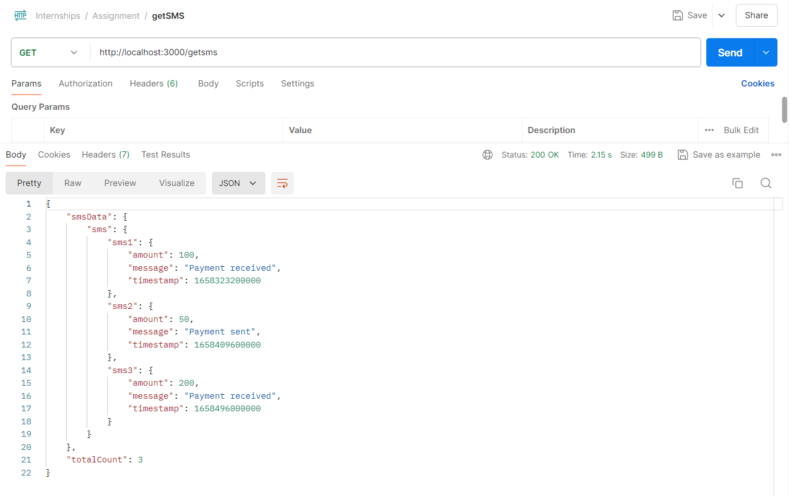
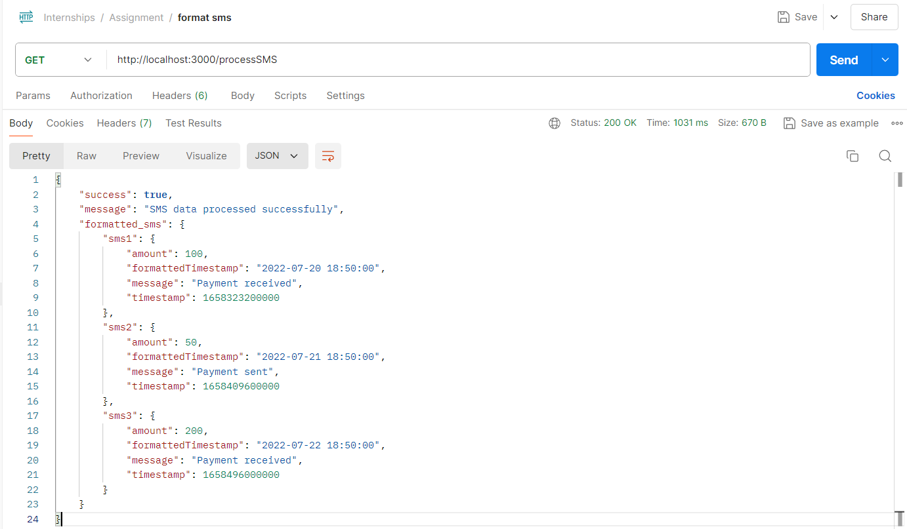
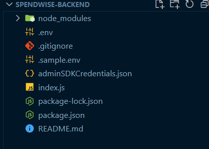

# Internship Task

This is Evaluation Task made for SpendWise by Abhyuday Pratap Singh.

---
# 1.0 Prerequisite
- Create a service account in the Firebase console and download the JSON file. 
- Rename the JSON file to this and place that in the root folder.
```bash
adminSDKCredentials.json
```
- Go to the Realtime Database section in the firebase and get the Database URL and paste in the .env file.
- You should have a Node.js version 20+ and Git installed.
  

# 2.0 Installation


 ## To run the project Manually:

Install the project by cloning this repo from your terminal.

- Step 1: Clone the Repo

```bash
 git clone https://github.com/abhyuday1212/Assignment4.git
```

- Go to the #root folder (Assignment4), open terminal in VS-Code and write this command
 
- Install the dependencies using this command for backend

```bash
 npm install
```

- If any ERR ocured in terminal the use this command and reinstall the dependencies using this line

```bash
  npm i --force
```
 
 
### Run the backend server.

- Goto #root folder and run these commands in your powershell.

- Open a new powershell and write this command to move to backend directory.
 

```bash
  npm run dev
```

- If terminal returns Port started successfully at ${PORT}


# Sample Images



